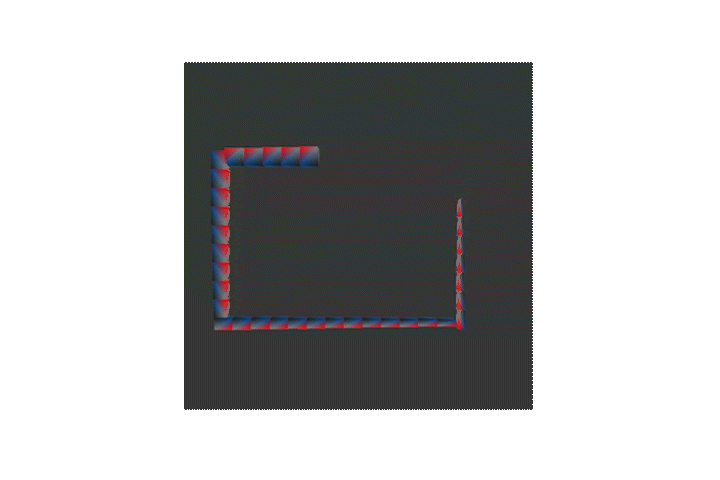

A simple game of snake made with openGL and GLFW for educational porpuses and i wanted to see what would be necessary to render into a computer screen 3d object (using libraries of course).

### Build

To build it create a new directory (if you wish) and build it the with cmake, it is necessary to put the files contained in the shader folder with the executable.

### How to use

In the game to move the snake you use the arrow keys to change the direction the snake is moving, when you lose a command propt is sent asking if you wish to continue where you can quit the program, you can also quit by pressing the 'ESC' key.

### Third party libraries and API's used:

https://www.opengl.org/
https://www.glfw.org/
https://github.com/Dav1dde/glad
https://github.com/g-truc/glm
